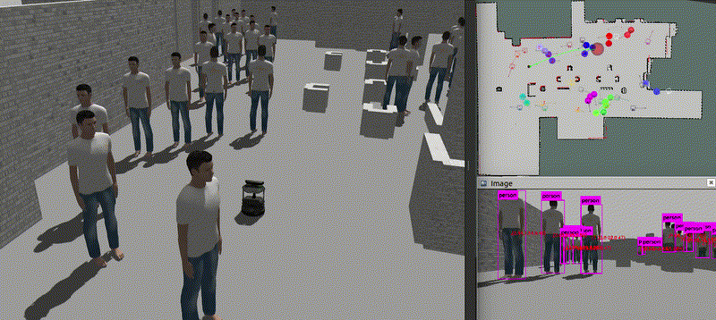
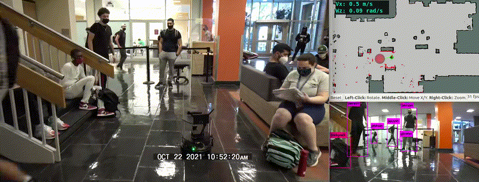
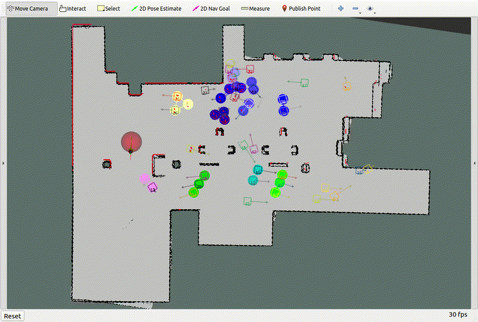

# SCOPE: Stochastic Cartographic Occupancy Prediction Engine for Uncertainty-Aware Dynamic Navigation

Implementation code for our paper ["SCOPE: Stochastic Cartographic Occupancy Prediction Engine for Uncertainty-Aware Dynamic Navigation"](https://arxiv.org/abs/2407.00144.pdf). 
This repository contains our costmap-based predictive uncertainty-aware navigation framework to incorporate OGM prediction and its uncertainty information (from our [SCOPE](https://github.com/TempleRAIL/scope) family) into current existing navigation control policies (model-based or learningbased) to improve their safe navigation performance in crowded dynamic scenes.
We present two examples of applying the SCOPE-based framework to navigation control policies: dwa_so_scope_pu for[DWA](http://wiki.ros.org/dwa_local_planner?distro=noetic) control policy and drl_vo_so_scope_pu for [DRL-VO](https://github.com/TempleRAIL/drl_vo_nav) control policy in our [3D human-robot interaction Gazebo simulator](https://github.com/TempleRAIL/pedsim_ros_with_gazebo).
Video demos can be found at [multimedia demonstrations](https://youtu.be/xJBtWQDLU04).
 
Here are two GIFs showing our DRL-VO control policy for navigating in the simulation and real world. 
* Simulation:
 
* Real world:
 

## Introduction:
To leverage the uncertainty information in the environmental future states and provide robust and reliable navigation behavior, we propose a general navigation control policy framework based on costmaps, which are used in the [move_base](http://wiki.ros.org/move_base) ROS navigation framework and can be integrated with most currently exiting control policies. 
Specifically, we use prediction and uncertainty costmaps to tell the robot the potentially dangerous areas ahead of it and how certain they are, which enables mobile robots to make safer nominal path plans, take proactive actions to avoid potential collisions and improve navigation capabilities.
Note that each costmap grid cell of our proposed prediction and uncertainty costmaps has an initial constant cost, and we map each occupied grid cell of the prediction costmap and uncertainty costmap to a Gaussian obstacle value rather than a ``lethal'' obstacle value. 
This is because the predicted obstacles and uncertainty regions are not real obstacle spaces. 

## Requirements:
* Ubuntu 20.04
* ROS-Noetic
* Python 3.8.5
* Pytorch 1.7.1
* Tensorboard 2.4.1
* Gym 0.18.0
* Stable-baseline3 1.1.0

## Installation:
This package requires these packages: 
* [drl_vo_nav](https://github.com/TempleRAIL/drl_vo_nav): contains our DRL-VO control policy.
* [robot_gazebo](https://github.com/TempleRAIL/robot_gazebo): contains our custom configuration files and maps for turtlebot2 navigation.
* [pedsim_ros_with_gazebo](https://github.com/TempleRAIL/pedsim_ros_with_gazebo): our customized 3D human-robot interaction Gazebo simulator based on [pedsim_ros](https://github.com/srl-freiburg/pedsim_ros).
* [turtlebot2 packages](https://github.com/zzuxzt/turtlebot2_noetic_packages): turtlebot2 packages on ROS noetic.

We provide two ways to install our DRL-VO navigation packages on Ubuntu 20.04:
1) independently install them on your PC;
2) use a [pre-created singularity container](https://doi.org/10.5281/zenodo.7679658) directly (no need to configure the environment).

### 1) Independent installation on PC:
1. install ROS Noetic by following [ROS installation document](http://wiki.ros.org/noetic/Installation/Ubuntu). 
2. install required learning-based packages:
```
pip install torch==1.7.1+cu110 -f https://download.pytorch.org/whl/torch_stable.html
pip install gym==0.18.0 pandas==1.2.1
pip install stable-baselines3==1.1.0
pip install tensorboard psutil cloudpickle
```
3. install Turtlebot2 ROS packages:
```
sudo apt-get install ros-noetic-move-base*
sudo apt-get install ros-noetic-map-server*
sudo apt-get install ros-noetic-amcl*
sudo apt-get install ros-noetic-navigation*
mkdir -p ~/catkin_ws/src
cd ~/catkin_ws/src
wget https://raw.githubusercontent.com/zzuxzt/turtlebot2_noetic_packages/master/turtlebot2_noetic_install.sh 
sudo sh turtlebot2_noetic_install.sh 
```
4. install DRL-VO ROS navigation packages:
```
cd ~/catkin_ws/src
git clone https://github.com/TempleRAIL/scope_nav.git
git clone https://github.com/TempleRAIL/robot_gazebo.git
git clone https://github.com/TempleRAIL/pedsim_ros_with_gazebo.git
git clone https://github.com/TempleRAIL/drl_vo_nav.git
cd ..
catkin_make
source ~/catkin_ws/devel/setup.sh
```

### 2) Using singularity container: all required packages are installed
1. install singularity software:
```
cd ~
wget https://github.com/sylabs/singularity/releases/download/v3.9.7/singularity-ce_3.9.7-bionic_amd64.deb
sudo apt install ./singularity-ce_3.9.7-bionic_amd64.deb
```
2. download pre-created ["drl_vo_container.sif"](https://doi.org/10.5281/zenodo.7679658) to the home directory.

3. install DRL-VO ROS navigation packages:
```
cd ~
singularity shell --nv drl_vo_container.sif
source /etc/.bashrc
mkdir -p ~/catkin_ws/src
cd ~/catkin_ws/src
git clone https://github.com/TempleRAIL/scope_nav.git
git clone https://github.com/TempleRAIL/robot_gazebo.git
git clone https://github.com/TempleRAIL/pedsim_ros_with_gazebo.git
git clone https://github.com/TempleRAIL/drl_vo_nav.git
cd ..
catkin_make
source ~/catkin_ws/devel/setup.sh
```

4. ctrl + D to exit the singularity container.

## Usage:
### Running on PC:
*  DWA navigation on desktop:
```
roslaunch scope_nav dwa_so_scope_pu_nav.launch
```
You can then use the "2D Nav Goal" button on Rviz to set a random goal for the robot, as shown below:
 

*  DRL-VO navigation on desktop:
```
roslaunch scope_nav drl_vo_so_scope_pu_nav.launch
```
You can then use the "2D Nav Goal" button on Rviz to set a random goal for the robot, as shown below:
 

### Running on singularity container:
*  DWA navigation on desktop:
```
cd ~
singularity shell --nv drl_vo_container.sif
source /etc/.bashrc
source ~/catkin_ws/devel/setup.sh
roslaunch scope_nav dwa_so_scope_pu_nav.launch
```
You can then use the "2D Nav Goal" button on Rviz to set a random goal for the robot, as shown below:
 

*  DRL-VO navigation on desktop:
```
cd ~
singularity shell --nv drl_vo_container.sif
source /etc/.bashrc
source ~/catkin_ws/devel/setup.sh
roslaunch scope_nav drl_vo_so_scope_pu_nav.launch
```
You can then use the "2D Nav Goal" button on Rviz to set a random goal for the robot, as shown below:
 


## Citation
```
@article{xie2024scope,
  title={SCOPE: Stochastic Cartographic Occupancy Prediction Engine for Uncertainty-Aware Dynamic Navigation},
  author={Xie, Zhanteng and Dames, Philip},
  journal={arXiv preprint arXiv:2407.00144},
  year={2024}
}

@inproceedings{xie2023sogmp,
  doi = {10.48550/ARXIV.2210.08577},
  title={Stochastic Occupancy Grid Map Prediction in Dynamic Scenes},
  author={Zhanteng Xie and Philip Dames},
  booktitle={Proceedings of The 7th Conference on Robot Learning},
  pages={1686--1705},
  year={2023},
  volume={229},
  series={Proceedings of Machine Learning Research},
  month={06--09 Nov},
  publisher={PMLR},
  url={https://proceedings.mlr.press/v229/xie23a.html}
}

```
